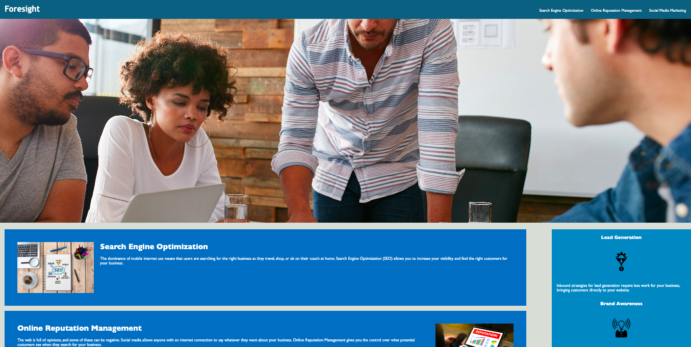

# Foresight Marketing Website

## Description 

A simple yet modern marketing website that helps businesses and individuals achieve their marketing goals.

This project is an attempt to build a modern marketing website from scratch, incorporating best practices in HTML, CSS, and web design. It was created as an exercise in self-learning and a means to explore various web design concepts.

## Why Foresight?
The primary motivation behind the project was to build a user-friendly, professional, and engaging marketing website that would help businesses and individuals achieve their marketing goals. The name "Foresight" was chosen as it conveys the essence of planning and forethought that are essential in successful marketing endeavors.

Key Features
Clean and modern design that caters to businesses and individuals
Easy-to-navigate interface that highlights the various sections of the website
Accessible layout for enhanced user experience

## Technical Stack
The website is built using HTML and CSS, ensuring maximum flexibility and adaptability across different platforms and devices. The HTML provides the basic structure of the website, while the CSS takes care of the styling and layout.

## How to Use
Clone the repository to your local machine.

Open the index.html file in your preferred web browser.

Explore the website to familiarize yourself with its various sections and features.

Make any necessary modifications to the code and reload the webpage to see the changes in real-time.

Please note that this project is in its initial stages and there may be some bugs or inconsistencies in the design. Continuous improvements and enhancements will be made over time as the project evolves.

Feel free to provide feedback or suggest any changes or improvements. Your input is highly valuable in shaping the project and ensuring that it meets your requirements and expectations.

## License
This project is licensed under the MIT License.

Please refer to the LICENSE file for more information.

## Screenshot preview of site

 

----

© 2023 edX Boot Camps LLC. Confidential and Proprietary. All Rights Reserved.
